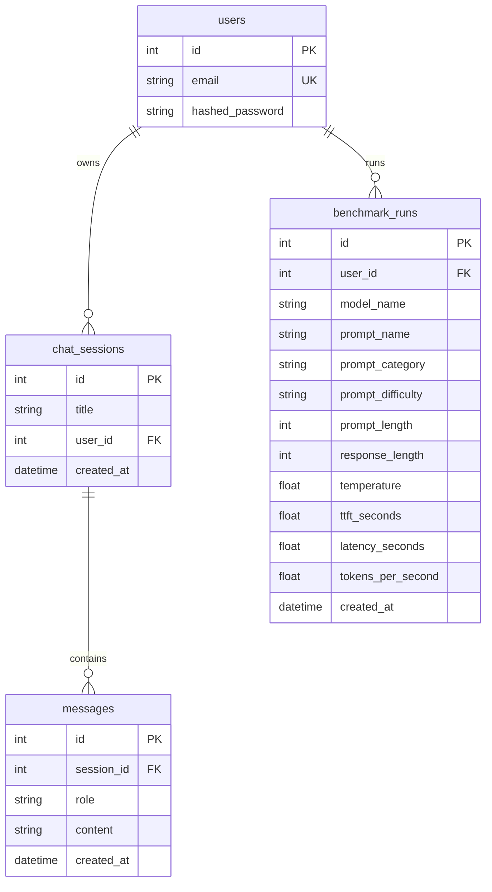

# Local AI Inference Platform — Developer Wiki

This is the comprehensive technical reference for the Local AI Inference Platform. It covers the full system architecture, database schema design, API surface, service logic, and deployment configuration. It is intended for developers, contributors, and AI coding agents onboarding to the project.

---

## 🏗️ Architecture Overview

The platform is organized as a workspace monorepo. A FastAPI backend handles authentication, persistent storage, and acts as the inference orchestration layer — delegating model calls to a locally-hosted Ollama daemon. A React + Vite frontend provides the analytics dashboard UI.

### Core System Diagram

```mermaid
graph TD
    subgraph Client ["Client Layer (apps/web)"]
        FE["React + Vite + Tailwind UI"]
        PAGES["Pages: Dashboard / BenchmarkRuns / Comparison"]
        APICLIENT["benchmarkApi.ts (Axios)"]
    end

    subgraph API ["Backend API Layer (apps/api)"]
        RT["FastAPI Routes (app/api/routes)"]
        DEP["Dependencies — JWT & DB (app/api/dependencies)"]
        SVC_AUTH["AuthService (app/services/auth_service.py)"]
        SVC_BENCH["BenchmarkService (app/services/benchmark_service.py)"]
        SVC_OLLAMA["OllamaService (app/services/ollama_service.py)"]
        CFG["Config/Settings (app/config/settings.py)"]
        DB["SQLAlchemy Session (app/db/)"]
        MD["DB Models — SQLite (app/models/)"]
    end

    subgraph Inference ["Local Inference Layer"]
        OL["Ollama Daemon (localhost:11434)"]
        QW["qwen2.5:3b"]
        LL["llama3.2:3b"]
        PH["phi3:mini"]
    end

    FE --> PAGES --> APICLIENT
    APICLIENT -->|HTTP / Bearer JWT| RT
    RT -->|Verify Token / Inject DB| DEP
    RT -->|Delegates Logic| SVC_AUTH
    RT -->|Delegates Benchmark Jobs| SVC_BENCH
    SVC_BENCH -->|Streaming Inference| SVC_OLLAMA
    SVC_BENCH -->|Persists Runs| MD
    MD -->|local_ai.db| DB
    CFG -->|Loads .env| API
    SVC_OLLAMA -->|ollama.chat() streaming| OL
    OL --> QW
    OL --> LL
    OL --> PH
```

---

## 📂 Project Directory Structure

```text
local-ai-inference-platform/
├── apps/
│   ├── api/                         # Backend Application
│   │   ├── app/                     # FastAPI Application Core
│   │   │   ├── api/
│   │   │   │   ├── routes/
│   │   │   │   │   ├── auth.py           # POST /register, POST /login, GET /me
│   │   │   │   │   ├── benchmarks.py     # POST /benchmarks/compare, GET /benchmarks, GET /benchmarks/runs
│   │   │   │   │   ├── session.py        # POST /chat/sessions
│   │   │   │   │   ├── structured.py     # Structured output endpoints
│   │   │   │   │   └── experiments.py    # Experiment tracking routes
│   │   │   │   └── dependencies.py       # JWT decoder & get_current_user
│   │   │   ├── benchmarks/
│   │   │   │   └── datasets/
│   │   │   │       └── default.json      # Benchmark prompt dataset (5 prompts, difficulty-tagged)
│   │   │   ├── config/
│   │   │   │   └── settings.py           # Pydantic Settings — loads .env
│   │   │   ├── core/
│   │   │   │   ├── constants.py          # MODEL_NAME constant
│   │   │   │   └── security.py           # bcrypt hashing & JWT signing
│   │   │   ├── db/
│   │   │   │   ├── database.py           # SQLAlchemy Base & engine
│   │   │   │   ├── dependencies.py       # get_db() session generator
│   │   │   │   └── session.py            # SessionLocal maker
│   │   │   ├── models/
│   │   │   │   ├── user.py               # User credentials table
│   │   │   │   ├── chat_session.py       # Conversation thread table
│   │   │   │   ├── message.py            # Individual message log table
│   │   │   │   ├── experiment.py         # Experiment metadata table
│   │   │   │   └── benchmark_run.py      # Benchmark run result table
│   │   │   ├── schemas/                  # Pydantic request/response schemas
│   │   │   ├── services/
│   │   │   │   ├── auth_service.py       # User registration & credential verification
│   │   │   │   ├── benchmark_service.py  # Orchestrates multi-model benchmark runs
│   │   │   │   ├── chat_service.py       # Chat session CRUD operations
│   │   │   │   └── ollama_service.py     # Low-level Ollama streaming & benchmarking client
│   │   │   └── main.py                   # FastAPI entry point, CORS, router mounting
│   │   ├── .env                          # Environment configuration (not committed)
│   │   ├── .env.example                  # Environment variable template
│   │   ├── pyproject.toml                # Backend dependencies (managed via uv)
│   │   └── local_ai.db                   # SQLite database (auto-created on startup)
│   └── web/                             # Frontend Application
│       ├── src/
│       │   ├── api/
│       │   │   └── benchmarkApi.ts       # Axios client for benchmark & summary endpoints
│       │   ├── components/
│       │   │   ├── BenchmarkChart.tsx    # Recharts bar chart wrapper
│       │   │   ├── ComparisonTable.tsx   # Model leaderboard table component
│       │   │   ├── Sidebar.tsx           # Navigation sidebar with active-link highlighting
│       │   │   └── StatCard.tsx          # Metric summary card (with hover shadow)
│       │   ├── layouts/
│       │   │   └── DashboardLayout.tsx   # Shared page layout container
│       │   ├── pages/
│       │   │   ├── Dashboard.tsx         # Main analytics & winner standings page
│       │   │   ├── BenchmarkRuns.tsx     # Historical run table with difficulty badges
│       │   │   ├── Benchmarks.tsx        # Run benchmark trigger page
│       │   │   └── Comparison.tsx        # Temperature-filtered side-by-side comparison
│       │   ├── App.tsx                   # Root router + sidebar layout shell
│       │   ├── index.css                 # Tailwind CSS directives + global resets
│       │   └── main.tsx                  # Vite + React DOM entrypoint
│       ├── tailwind.config.js            # Tailwind CSS v3 content scanning config
│       ├── postcss.config.js             # PostCSS plugin pipeline (Tailwind + Autoprefixer)
│       └── package.json                  # Frontend dependencies (managed via pnpm)
├── docker/                              # Docker Compose containerization
├── experiments/                         # Standalone ML experiment scripts
├── prompts/                             # Prompt engineering files
└── reports/                             # Generated benchmark output reports
```

---

## 🗄️ Database Architecture & Schemas

All state is persisted in a local SQLite file (`local_ai.db`). Tables are managed via SQLAlchemy declarative ORM models. The schema auto-initializes on backend startup via `Base.metadata.create_all(bind=engine)`.



### Table Descriptions

| Table | Purpose |
|---|---|
| `users` | Registered accounts. Stores unique email and bcrypt-hashed password. Cascade-deletes sessions. |
| `chat_sessions` | Conversation threads linked to a user. |
| `messages` | Individual `user`/`assistant`/`system` turns inside a session. |
| `benchmark_runs` | One row per prompt per model per benchmark run. Stores TTFT, latency, TPS, temperature, prompt difficulty, and character lengths. |

---

## 🛠️ Technology Stack

| Component | Technology | Version | Purpose |
| :--- | :--- | :--- | :--- |
| **Backend Core** | FastAPI + Python | `3.11+` | High-performance async API |
| **Dependency Manager** | `uv` | Latest | Fast Python resolver & venv manager |
| **Settings** | Pydantic Settings v2 | `^2.13.0` | Strongly-typed `.env` loading |
| **Inference Client** | Ollama Python SDK | `^0.6.2` | Streaming chat & model listing |
| **ORM** | SQLAlchemy | Latest | DB models, sessions, migrations |
| **Auth** | Bcrypt + Python-Jose | Latest | Password hashing & JWT signing |
| **Frontend** | React 19 + TypeScript | `^19.2.6` | UI rendering |
| **Build Tool** | Vite 8 | Latest | Dev server and production bundler |
| **Styling** | Tailwind CSS | v3 | Utility-first CSS |
| **Charts** | Recharts | `^3.8.1` | Bar chart visualizations |
| **Data Fetching** | Axios + TanStack Query | Latest | HTTP client + caching |
| **Package Manager** | pnpm | Latest | Workspace monorepo dependency caching |
| **Inference Server** | Ollama | Local | Locally-hosted LLM runtime |

---

## 🔌 API Reference

All routes are prefixed with `/api`. Authenticate requests using a Bearer JWT token in the `Authorization` header.

### System

| Method | Path | Auth | Description |
|---|---|---|---|
| `GET` | `/health` | No | Returns Ollama connection status and available models |

### Authentication (`/api/auth`)

| Method | Path | Body | Description |
|---|---|---|---|
| `POST` | `/api/auth/register` | `{ email, password }` | Register a new user |
| `POST` | `/api/auth/login` | `{ email, password }` | Returns a `access_token` JWT |
| `GET` | `/api/auth/me` | — | Returns the current authenticated user profile |

### Benchmarks (`/api/benchmarks`)

| Method | Path | Body / Auth | Description |
|---|---|---|---|
| `POST` | `/api/benchmarks/compare` | `{ models: string[], temperature: float }` | Run benchmarks across one or more models. Validates model availability first. Returns averaged results per model. |
| `GET` | `/api/benchmarks` | Bearer | Returns per-model averaged summary from all historical runs |
| `GET` | `/api/benchmarks/runs` | Bearer | Returns full list of individual run rows, ordered newest first |

#### Benchmark Response Schema

```json
{
  "qwen2.5:3b": {
    "average_ttft": 0.81,
    "average_latency": 3.98,
    "average_tokens_per_second": 40.17,
    "prompts_tested": 5
  }
}
```

---

## 📊 Benchmark Dataset

Located at `apps/api/app/benchmarks/datasets/default.json`. Five prompts are evaluated per model per run.

| Name | Category | Difficulty |
|---|---|---|
| `reasoning_1` | reasoning | easy |
| `reasoning_2` | reasoning | medium |
| `coding_1` | coding | medium |
| `summarization_1` | summarization | easy |
| `extraction_1` | extraction | easy |

---

## 🔬 Benchmark Metrics Explained

| Metric | Calculation | What it measures |
|---|---|---|
| **TTFT (Time to First Token)** | `time` from request start until first chunk arrives | Model responsiveness / cold-start latency |
| **Latency** | `time` from request start until full response completes | Total wall-clock inference time |
| **TPS (Tokens per Second)** | `estimated_token_count / latency` | Generation throughput (word-split estimate) |
| **estimated_token_count** | `len(response.split())` | Word-count approximation. Not a tokenizer-accurate count. |

> **Note on token counting:** The current implementation uses word-split estimation. A future upgrade can swap this for model-specific tokenizers (e.g., via `tiktoken` or the Ollama tokenize API).

---

## ⚙️ Environment Configuration

Located at `apps/api/.env`. Loaded via Pydantic Settings into `app/config/settings.py`.

```env
APP_NAME=Local AI Inference Platform
MODEL_NAME=qwen2.5:3b
OLLAMA_HOST=http://localhost:11434
JWT_SECRET_KEY=your-secure-random-string
JWT_ALGORITHM=HS256
ACCESS_TOKEN_EXPIRE_MINUTES=30
DATABASE_URL=sqlite:///./local_ai.db
```

> [!IMPORTANT]
> All `Settings` attributes have typed default fallbacks. This satisfies Pylance static analysis and prevents `Arguments missing` errors when instantiating `settings` without a loaded `.env`.

---

## 🚀 Execution & Setup

### 1. Start Ollama (in WSL or a Linux shell)

```bash
ollama serve

# Pull benchmark models
ollama pull qwen2.5:3b
ollama pull llama3.2:3b
ollama pull phi3:mini
```

### 2. Start the FastAPI Backend

```bash
cd apps/api
uv sync
uvicorn app.main:app --reload
```

- API: `http://127.0.0.1:8000`
- Swagger UI: `http://127.0.0.1:8000/docs`

### 3. Start the React Frontend

```bash
cd apps/web
pnpm install
pnpm run dev
```

- UI: `http://localhost:5173`

---

## 🔮 Roadmap

- [x] JWT authentication (register, login, protected routes)
- [x] Persistent chat sessions and message history
- [x] Real-time SSE token streaming
- [x] Structured benchmark dataset with difficulty levels
- [x] Multi-model parallel benchmarking via `POST /api/benchmarks/compare`
- [x] TTFT, latency, TPS tracking per run
- [x] Temperature tracking and per-model result comparison
- [x] Analytics dashboard (winner cards, leaderboard table, bar charts)
- [x] Benchmark run history page with difficulty badges
- [x] Model Comparison page with temperature filter selector
- [x] Sidebar navigation with active route highlighting
- [x] Tailwind CSS design system
- [ ] Model-specific tokenizer integration (replace word-split estimate)
- [ ] Alembic database migrations for schema versioning
- [ ] Export benchmark results to CSV / PDF report
- [ ] Docker Compose unified deployment
- [ ] Dark mode UI toggle
