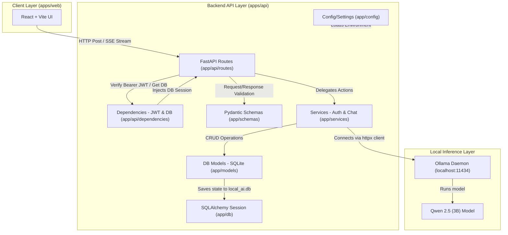
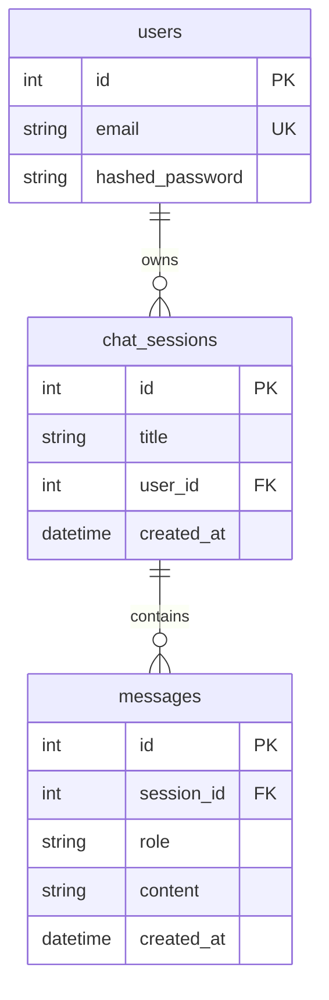

# Local AI Inference Platform - Project Wiki

Welcome to the **Local AI Inference Platform**! This wiki acts as the comprehensive source of truth for the codebase architecture, tech stack, database schemas, and execution guidelines. It is designed to help developer agents and human collaborators onboard and understand the project quickly.

---

## 🏗️ Architecture Overview

The project is structured as a monorepo containing a high-performance, asynchronous Python FastAPI backend and a responsive React frontend. It leverages local inference engines (specifically **Ollama**) to stream large language model completions securely and privately on the host machine.

### Core System Diagram



---

## 📂 Project Directory Structure

```text
local-ai-inference-platform/
├── apps/
│   ├── api/                   # Backend Application
│   │   ├── app/               # FastAPI Application Core
│   │   │   ├── api/           # API Routers & Route Endpoints
│   │   │   │   ├── routes/    # Endpoint Groupings
│   │   │   │   │   ├── auth.py     # Auth Routes (Register, Login, Me)
│   │   │   │   │   ├── chat.py     # Chat Routes (Streaming completions)
│   │   │   │   │   └── session.py  # Conversational session management
│   │   │   │   ├── dependencies.py # JWT Decoder & get_current_user
│   │   │   │   └── router.py  # Unified API Route compilation
│   │   │   ├── config/        # Environment Configuration (settings.py)
│   │   │   ├── core/          # Security, token signing & constants
│   │   │   │   ├── constants.py
│   │   │   │   └── security.py     # Bcrypt & Access Token (JWT) tools
│   │   │   ├── db/            # Database Connections
│   │   │   │   ├── database.py     # SQLAlchemy Base & Engine
│   │   │   │   ├── dependencies.py # get_db session generator
│   │   │   │   └── session.py      # SessionLocal maker
│   │   │   ├── models/        # Database SQLAlchemy Models
│   │   │   │   ├── chat_session.py # ChatSession table
│   │   │   │   ├── message.py      # Message log table
│   │   │   │   └── user.py         # User credentials table
│   │   │   ├── schemas/       # Pydantic Schemas (validation)
│   │   │   │   ├── chat.py         # ChatRequest & ChatResponse schemas
│   │   │   │   ├── chat_session.py # SessionCreate & SessionResponse schemas
│   │   │   │   └── user.py         # UserCreate & TokenResponse schemas
│   │   │   ├── services/      # Service Layer (Business Logic)
│   │   │   │   ├── auth_service.py # User registration & verification
│   │   │   │   ├── chat_service.py # Session CRUD operations
│   │   │   │   └── ollama_service.py # Local LLM streaming handler
│   │   │   └── main.py        # Backend FastAPI Entry Point & CORS Setup
│   │   ├── .venv/             # Python Virtual Environment
│   │   ├── pyproject.toml     # Backend dependencies (managed via uv)
│   │   ├── uv.lock            # Backend Lockfile
│   │   └── .env               # Backend Environment variables
│   └── web/                   # Frontend Application (React + Vite + TypeScript)
│       ├── src/               # React Source Files
│       │   ├── assets/        # Media and static assets
│       │   ├── App.tsx        # Main UI Component
│       │   ├── App.css        # App CSS styles
│       │   ├── index.css      # Base Tailwind/Global CSS
│       │   └── main.tsx       # Vite entrypoint
│       └── package.json       # Frontend dependencies (managed via pnpm)
├── packages/
│   └── shared/                # Intended for shared monorepo modules
├── docker/                    # Docker containerization resources
├── experiments/               # ML & AI testing scripts/notebooks
├── prompts/                   # System prompt design files
└── reports/                   # Performance & benchmarking logs
```

---

## 🗄️ Database Architecture & Schemas

The application persists state locally using a relational SQLite database file (`local_ai.db`). The tables and relations are managed through SQLAlchemy models:



1. **Users (`users` table):**
   * Manages unique emails and secure password representations hashed via bcrypt.
   * Cascade-deletes all owned `chat_sessions` and `messages` if a user is deleted.
2. **Chat Sessions (`chat_sessions` table):**
   * Stores conversational threads. Includes a timezone-aware creation UTC timestamp.
3. **Messages (`messages` table):**
   * Individual conversation turns containing a role (`user`, `assistant`, `system`) and raw text content.

---

## 🛠️ Technology Stack

| Component | Technology | Version | Purpose |
| :--- | :--- | :--- | :--- |
| **Backend Core** | Python, FastAPI | `3.11+` | High-performance asynchronous API endpoints |
| **Dependency Manager** | `uv` | Latest | Extremely fast Python dependency resolver and installer |
| **Settings Management** | Pydantic Settings | `^2.13.0` | Strongly-typed configuration with environment validation |
| **Inference Client** | Ollama Python SDK | `^0.6.2` | Interfaces directly with local Ollama daemon |
| **Database ORM** | SQLAlchemy | Latest | Database schemas, connections, and sessions |
| **Security Encryption** | Bcrypt, Python-Jose | Latest | Hashing passwords and cryptographically signing JWTs |
| **Frontend Core** | React | `^19.2.6` | Client UI rendering |
| **Build Tool** | Vite, TypeScript | Latest | Ultra-fast local development server and compilation |
| **Package Manager** | `pnpm` | Latest | Workspace monorepo dependency caching |
| **Data Fetching** | Axios, React Query | Latest | Declarative caching and data synchronization |
| **Inference Server** | Ollama | Local | Locally-hosted LLM runtime environment |

---

## ⚙️ Environment Configuration

Backend configurations are managed securely using environment variables located in `apps/api/.env`. These variables are mapped into Python types via [settings.py](file:///d:/Machine%20Learning/local-ai-inference-platform/apps/api/app/config/settings.py).

### Loaded Parameters

* `APP_NAME`: Title of the platform (Defaults to `"Local AI Inference Platform"`).
* `MODEL_NAME`: Local LLM identifier (Defaults to `"qwen2.5:3b"`).
* `OLLAMA_HOST`: The endpoint where Ollama service is listening (Defaults to `http://localhost:11434`).
* `JWT_SECRET_KEY`: Secret used to sign user auth tokens.
* `JWT_ALGORITHM`: Cryptographic signature format (Defaults to `"HS256"`).
* `ACCESS_TOKEN_EXPIRE_MINUTES`: Expiration time for login tokens.
* `DATABASE_URL`: Connection string for SQLAlchemy (Defaults to `sqlite:///./local_ai.db`).

> [!IMPORTANT]
> **Static Type Resolution (Pylance):**
> All configuration attributes in `Settings` are declared with safe fallback default values matching `.env`. This completely satisfies Pylance/VS Code static check analyzers and eliminates `Arguments missing` type errors during instantiation.

---

## 🚀 Execution & Setup Guide

### 1. Local AI Backend (Ollama)
Before launching the software, ensure the local inference daemon is running:
1. Start the Ollama Desktop App or run `ollama serve` in your terminal.
2. Verify the server is active at `http://localhost:11434`.
3. Pull the required model:
   ```bash
   ollama pull qwen2.5:3b
   ```

### 2. FastAPI Backend
The API leverages the Python interpreter inside `apps/api/.venv/`.
1. Select `apps/api/.venv/Scripts/python.exe` as the VS Code Python interpreter.
2. From `apps/api/`, run the Uvicorn development server:
   ```bash
   uvicorn app.main:app --reload
   ```
*(Note: The database `local_ai.db` will automatically initialize its tables upon backend launch)*

### 3. React Frontend
The web interface is managed via `pnpm`.
1. Navigate to the `apps/web` directory.
2. Install dependencies:
   ```bash
   pnpm install
   ```
3. Start the Vite server:
   ```bash
   pnpm run dev
   ```

---

## 🔮 Roadmap & Future Scope
- [x] Create core schemas and relational tables for session preservation.
- [x] Configure JWT bearer-auth and user registrations.
- [ ] Implement robust user session controls and history loading on the frontend.
- [ ] Write benchmarking scripts under `experiments/` to capture tokens per second for local models.
- [ ] Dockerize both services inside `docker-compose.yml` for unified distribution.
