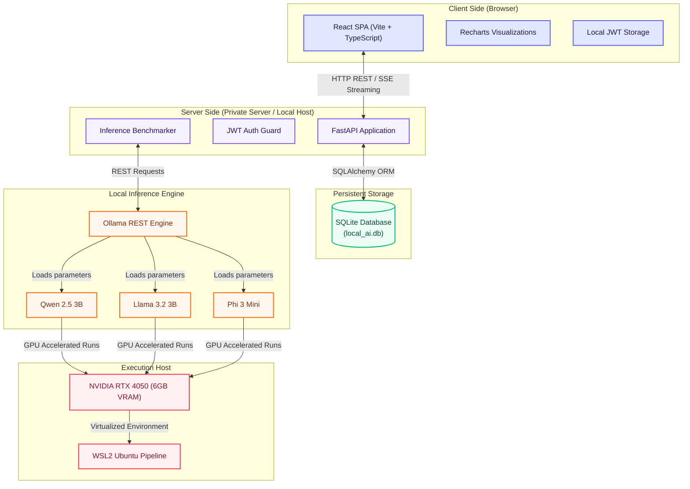

# 🤖 Local AI Inference Platform (Monorepo)


🌐 Live Demo: https://local-ai-inference-platform.vercel.app

A **fully local, privacy-first benchmarking and inference platform** for open-source LLMs. This monorepo lets you register accounts, run structured benchmarks across multiple Ollama models simultaneously, compare performance metrics in a polished analytics dashboard, and stream real-time chat completions — all without any cloud dependencies.

---

## 🏗️ Monorepo Structure

```text
local-ai-inference-platform/
├── apps/
│   ├── api/          # FastAPI backend (Python 3.11+, SQLAlchemy, JWT, uv)
│   └── web/          # React + Vite + TypeScript frontend (React 19, Tailwind CSS, Recharts, pnpm)
├── packages/
│   └── shared/       # Workspace for shared types and helper packages
├── docker/           # Docker Compose setup for containerized deployment
├── experiments/      # Standalone ML scripts and Jupyter notebooks
├── prompts/          # System prompt engineering files
├── reports/          # Benchmark output logs and performance reports
├── LLM_WIKI.md       # Deep-dive developer wiki (ERDs, architecture diagrams, API reference)
└── README.md         # Monorepo overview & Quick Start (this file)
```

---

## 🚀 Key Platform Features

* **Multi-Model Benchmarking:** Run `POST /api/benchmarks/compare` to benchmark one or many Ollama models simultaneously across a structured prompt dataset with difficulty levels (`easy`, `medium`, `hard`).
* **Real-time Analytics Dashboard:** Interactive performance dashboard with winner standings, a leaderboard table, and side-by-side bar charts for TTFT, latency, and throughput.
* **Model Comparison View:** Filter all historical runs by temperature parameter and compare models on a dedicated `/comparison` page.
* **Real-time SSE Streaming:** Streams chat token completions chunk-by-chunk using Server-Sent Events (SSE) for low-latency interactive chat.
* **Persistent Chat Sessions:** Retains complete user conversation histories in a local SQLite database using SQLAlchemy.
* **Secure JWT Authentication:** Email-based registrations, login, and Bearer Token request validation via `python-jose`.
* **Model Availability Guard:** Validates that requested Ollama models are installed via `ollama.list()` before any benchmark job starts — preventing mid-run failures.

---

## 🏗️ System Architecture



---

## ⚙️ Development Prerequisites

Ensure you have the following installed on your machine:

1. **Ollama** — Download and run from [ollama.com](https://ollama.com). If you are on Windows, Ollama should ideally run inside WSL (Windows Subsystem for Linux) for best compatibility.
2. **Python 3.11+** — Required for the FastAPI backend.
3. **uv** — Fast Python dependency resolver/installer:
   ```bash
   pip install uv
   # or on macOS/Linux:
   curl -LsSf https://astral.sh/uv/install.sh | sh
   ```
4. **Node.js 18+ & pnpm** — Required for the React frontend:
   ```bash
   npm install -g pnpm
   ```

---

## ⚡ Quick Start Guide

### Step 1: Initialize the Inference Engine (Ollama)

Make sure the Ollama service is running. In WSL or a Linux shell:

```bash
ollama serve
```

Pull the three benchmark models used in the platform:

```bash
ollama pull qwen2.5:3b
ollama pull llama3.2:3b
ollama pull phi3:mini
```

Verify Ollama is listening:
```bash
curl http://localhost:11434/api/tags
```

---

### Step 2: Start the FastAPI Backend

```powershell
cd apps/api
uv sync
uvicorn app.main:app --reload
```

> The API is now running at **`http://127.0.0.1:8000`**.  
> Database tables (`users`, `chat_sessions`, `messages`, `benchmark_runs`) initialize automatically on first launch inside `local_ai.db`.

Configure your environment by copying the example file:

```powershell
copy .env.example .env
```

Then edit `apps/api/.env` to set your values:

```env
APP_NAME=Local AI Inference Platform
MODEL_NAME=qwen2.5:3b
OLLAMA_HOST=http://localhost:11434
JWT_SECRET_KEY=your-secret-key-here
JWT_ALGORITHM=HS256
ACCESS_TOKEN_EXPIRE_MINUTES=30
DATABASE_URL=sqlite:///./local_ai.db
```

---

### Step 3: Start the React Frontend

```powershell
cd apps/web
pnpm install
pnpm run dev
```

> The UI is now accessible at **`http://localhost:5173`**.

---

## 🧪 Testing the Application

### Manual API Testing (via Swagger UI)

With the backend running, open the interactive Swagger UI:
```
http://127.0.0.1:8000/docs
```

#### Test Sequence

**1. Register a user:**
```http
POST /api/auth/register
Content-Type: application/json

{
  "email": "user@example.com",
  "password": "password123"
}
```

**2. Login and get a token:**
```http
POST /api/auth/login
Content-Type: application/json

{
  "email": "user@example.com",
  "password": "password123"
}
```

Copy the returned `access_token`.

**3. Health check:**
```http
GET /health
```
Should return `"ollama": "connected"` and list installed models.

---

### Benchmark Tests

Use your Bearer token in the `Authorization` header for all benchmark endpoints.

**Test 1 — Single model (smoke test):**
```http
POST /api/benchmarks/compare
Authorization: Bearer <your-token>
Content-Type: application/json

{
  "models": ["qwen2.5:3b"],
  "temperature": 0.0
}
```

**Test 2 — All 3 models:**
```http
POST /api/benchmarks/compare
Authorization: Bearer <your-token>
Content-Type: application/json

{
  "models": ["qwen2.5:3b", "llama3.2:3b", "phi3:mini"],
  "temperature": 0.0
}
```

Expected response shape:
```json
{
  "qwen2.5:3b": {
    "average_ttft": 0.81,
    "average_latency": 3.98,
    "average_tokens_per_second": 40.17,
    "prompts_tested": 5
  },
  "llama3.2:3b": { ... },
  "phi3:mini": { ... }
}
```

**Test 3 — Temperature experiment (temp 0.7):**
```http
POST /api/benchmarks/compare
...
{ "models": ["qwen2.5:3b", "llama3.2:3b", "phi3:mini"], "temperature": 0.7 }
```

**Test 4 — Invalid model validation:**
```http
POST /api/benchmarks/compare
...
{ "models": ["gpt-99-super-model"] }
```

Expected error:
```json
{ "detail": "Model gpt-99-super-model not installed" }
```

**View run history:**
```http
GET /api/benchmarks/runs
Authorization: Bearer <your-token>
```

**Get summary grouped by model:**
```http
GET /api/benchmarks
Authorization: Bearer <your-token>
```

---

### Frontend UI Testing

Navigate to each page and verify:

| Page | URL | What to verify |
|------|-----|----------------|
| Dashboard | `http://localhost:5173/` | Stat cards, winner standings, leaderboard table, bar charts |
| Benchmark Runs | `http://localhost:5173/benchmark-runs` | Historical run table with difficulty badges and timestamps |
| Comparison | `http://localhost:5173/comparison` | Temperature filter selector, charts update on selection |

> **Note:** You must have a valid JWT token stored in `localStorage` under the key `token` for the frontend pages to fetch data. You can set this manually in the browser DevTools console after logging in via Swagger.

---

## 🐳 Deployment

### Option A — Docker Compose (Recommended)

A Docker Compose setup is available in `docker/`. This will run the API and Ollama side-by-side in containers.

```bash
# From the monorepo root
docker compose up --build
```

> Ensure your `docker-compose.yml` binds the API to `0.0.0.0:8000` and sets `OLLAMA_HOST` to point to the Ollama container/service.

---

### Option B — Manual VPS/Server Deployment

#### Backend (FastAPI + Uvicorn + Gunicorn)

1. Clone the repo onto your server.
2. Install `uv` and sync dependencies:
   ```bash
   cd apps/api
   uv sync
   ```
3. Run the server using Gunicorn with Uvicorn workers for production:
   ```bash
   gunicorn app.main:app \
     -k uvicorn.workers.UvicornWorker \
     --bind 0.0.0.0:8000 \
     --workers 2
   ```
4. Use **Nginx** as a reverse proxy to forward traffic from port 80/443 to port 8000.

#### Frontend (Static Build)

1. Build the production bundle:
   ```bash
   cd apps/web
   pnpm run build
   ```
2. The output is in `apps/web/dist/`. Serve it using Nginx or upload it to any static hosting service (e.g., Vercel, Netlify, Cloudflare Pages).

   Example Nginx config snippet:
   ```nginx
   server {
     listen 80;
     server_name your-domain.com;

     root /var/www/local-ai/apps/web/dist;
     index index.html;

     location / {
       try_files $uri $uri/ /index.html;
     }

     location /api {
       proxy_pass http://127.0.0.1:8000;
       proxy_set_header Host $host;
       proxy_set_header X-Real-IP $remote_addr;
     }
   }
   ```

#### Ollama on Server

Install Ollama on the server and run it as a background service:
```bash
curl -fsSL https://ollama.com/install.sh | sh
ollama serve &

# Pull all benchmark models
ollama pull qwen2.5:3b
ollama pull llama3.2:3b
ollama pull phi3:mini
```

Update `OLLAMA_HOST` in `.env` to point to your Ollama instance.

---

## 📖 Developer Documentation

For a deep dive into the architecture, database schemas, API reference, and business logic, see the **[LLM_WIKI.md](./LLM_WIKI.md)** in the repository root.
