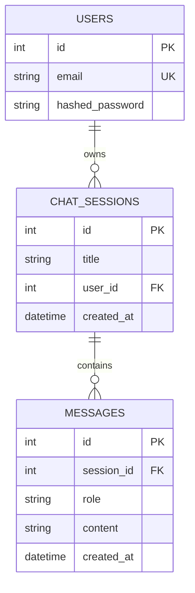

# ⚡ Local AI Inference Platform - Backend API

Welcome to the backend API of the **Local AI Inference Platform**. This service is a high-performance, asynchronous FastAPI application that manages user authentication, stores chat sessions and message histories in a local database, and integrates directly with a local **Ollama** engine to stream model inference.

---

## 🚀 Key Features

* **JWT-Based Authentication:** Secure user signup and login utilizing `bcrypt` password hashing and `python-jose` for JSON Web Tokens.
* **Database Persistence:** SQLite database integration with SQLAlchemy ORM, managing `users`, `chat_sessions`, and `messages` tables.
* **Local Inference Integration:** Directly connects to local Ollama servers (defaulting to the `qwen2.5:3b` model) to stream real-time chat responses.
* **Auto DB Initialization:** Automatic database table schema generation on startup (`Base.metadata.create_all`).
* **Environment-Safe Config:** Dynamic environment loading and robust settings using Pydantic Settings with full static typing fallbacks to satisfy Pylance.

---

## 🛠️ Technology Stack

* **Core Framework:** [FastAPI](https://fastapi.tiangolo.com/) + [Uvicorn](https://www.uvicorn.org/) (Asynchronous Server Gateway)
* **Inference Engine:** [Ollama Python SDK](https://github.com/ollama/ollama-python)
* **Database ORM:** [SQLAlchemy](https://www.sqlalchemy.org/)
* **Dependency Manager:** [uv](https://github.com/astral-sh/uv) (Extreme speed package resolver)
* **Configuration:** [Pydantic Settings v2](https://docs.pydantic.dev/latest/concepts/pydantic_settings/)
* **Security & Auth:** [Bcrypt](https://pypi.org/project/bcrypt/) + [Python-Jose (JWT)](https://pypi.org/project/python-jose/)

---

## 🗄️ Database Architecture

The API uses a local SQLite database file `local_ai.db`. The relational schema is modeled using SQLAlchemy's modern mapped annotations:



### Models Summary

1. **`User`** (`users`): Represents registered platform users. Stores an unique email index and bcrypt hashed passwords. Has a cascade relation to `chat_sessions`.
2. **`ChatSession`** (`chat_sessions`): Groups messages into isolated conversational threads. Linked to a parent `User`.
3. **`Message`** (`messages`): Individual message nodes inside a session. Stores `role` (`user`, `assistant`, `system`), text `content`, and UTC creation timestamps.

---

## 🔌 API Endpoints Reference

All API routes are prefixed by `/api`. Detailed schema descriptions can be previewed at `/docs` (Swagger UI).

### 1. System Operations
* **`GET /health`**: Verifies backend connection, displays current active local model, and queries the local Ollama daemon for a list of available local models.

### 2. Authentication Route Set (`/api/auth`)
* **`POST /api/auth/register`**: Registers a new user. Expects JSON body with `email` and `password`.
* **`POST /api/auth/login`**: Authenticates user credentials. Returns a JWT Bearer token on success.
* **`GET /api/auth/me`**: Fetches the authenticated user profile. Requires a valid JWT token passed in the `Authorization: Bearer <TOKEN>` header.

### 3. Conversational Routes (`/api/chat`)
* **`POST /api/chat/sessions`**: Initiates a new persistent conversation thread under the authenticated user.
* **`POST /api/chat`**: Handles streaming inference. Streams response tokens directly from the local Ollama daemon chunk-by-chunk using Server-Sent Events (SSE).

---

## ⚙️ Setting Up & Running Locally

### 1. Initialize dependencies
The backend uses `uv` for python environments. Navigate to the backend directory (`apps/api`):
```powershell
cd apps/api
```

Synchronize the dependencies and create the `.venv`:
```powershell
uv sync
```

### 2. Verify `.env` parameters
Ensure `apps/api/.env` exists and contains your parameters. If it doesn't, create it:
```env
APP_NAME=Local AI Inference Platform
MODEL_NAME=qwen2.5:3b
OLLAMA_HOST=http://localhost:11434
JWT_SECRET_KEY=generate_a_random_jwt_key_here
JWT_ALGORITHM=HS256
ACCESS_TOKEN_EXPIRE_MINUTES=30
DATABASE_URL=sqlite:///./local_ai.db
```

### 3. Spin Up the Server
Run the Uvicorn ASGI server with hot reloading enabled:
```powershell
uvicorn app.main:app --reload
```

The terminal will confirm the server is running on `http://127.0.0.1:8000`. You can test the setup by loading the health check page: `http://127.0.0.1:8000/health`.
